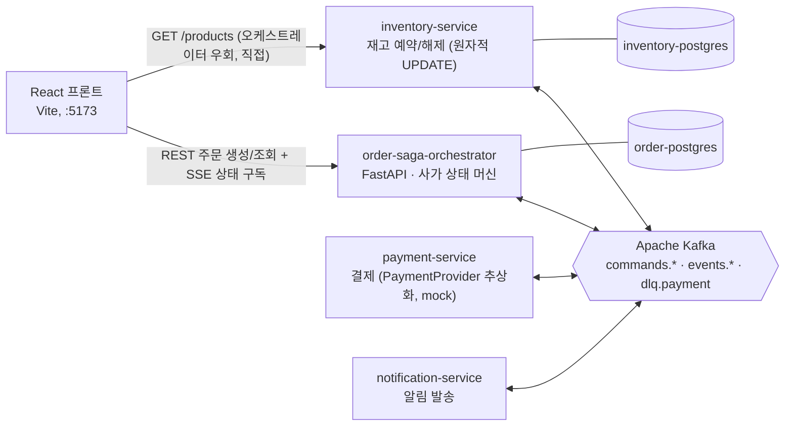
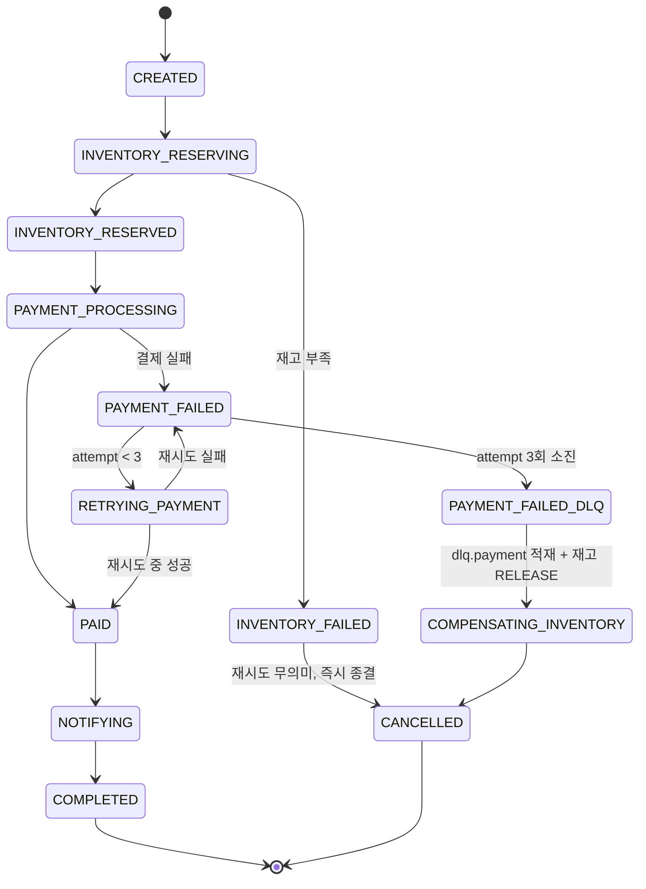

# order-pipeline

이벤트 기반 비동기 주문 처리 시스템 — Kafka 기반 **Saga Orchestration** 실습 프로젝트.

주문 하나가 재고 예약 → 결제 → 알림을 거쳐 완료되고, 중간에 실패하면 **보상 트랜잭션**으로
이전 단계를 되돌린다. 결제는 최대 3회까지 시도(최초 1회 + 재시도 2회)하고, 소진되면 DLQ에 적재한 뒤 재고를 복구한다.

## 아키텍처



토픽 흐름: 오케스트레이터가 `commands.inventory` / `commands.payment` / `commands.notification`을 발행하고,
각 서비스는 처리 결과를 `events.*`로 되돌린다. 결제가 3회 시도 모두 실패하면 마지막 실패 이벤트를 `dlq.payment`에
적재하고 `commands.inventory`(RELEASE)로 재고를 되돌린다.

- **Orchestration 방식**: 중앙 오케스트레이터가 각 서비스에 커맨드를 보내고 응답 이벤트로 다음 단계를 결정.
  사가 상태가 한 곳에 모여 프론트가 구독할 "단일 상태 소스"가 명확함.
- **database-per-service**: 오케스트레이터(`order-postgres`)와 inventory-service(`inventory-postgres`)가
  각자 별도 PostgreSQL. payment/notification-service는 무상태라 DB 없음.
- **`GET /products`는 오케스트레이터를 거치지 않는다**: 재고의 진짜 소스(inventory-service의 DB)에 프론트가
  직접 물어본다. 오케스트레이터가 프록시로 감싸면 inventory-service 장애가 무관한 엔드포인트까지 전파됨.
- **서비스 간 코드 공유 없음**: 4개 서비스는 서로의 코드를 모른다. Kafka 메시지 스키마는 스펙 문서로만 합의하고
  각자 독립적으로 Pydantic 모델을 정의 (distributed monolith 회피).

상세 설계: [`docs/superpowers/specs/2026-08-18-order-pipeline-design.md`](docs/superpowers/specs/2026-08-18-order-pipeline-design.md)

## 상태 머신



재고부족과 결제실패를 **비대칭**으로 처리하는 것이 핵심 설계 포인트 — 재고부족은 재시도해도 결과가
같으므로 즉시 취소, 결제실패만 일시적 오류로 보고 재시도 대상.

## 기술 스택

| 영역 | 스택 |
|---|---|
| 메시징 | Apache Kafka (KRaft), confluent-kafka-python |
| 서비스 | FastAPI, SQLAlchemy 2.0 (async), asyncpg, Alembic |
| 프론트 | Vite + React + TypeScript, TanStack Query, SSE (EventSource) |
| 인프라 | Docker Compose |

## 실행

**필요한 것**: Docker + Docker Compose v2. 로컬에 Python/Node/uv 설치 불필요 — 전부 컨테이너에서 돈다.

```bash
docker compose up -d --build

# 처음 뜰 때(새 Kafka 볼륨)는 토픽을 먼저 만들고 서비스를 재시작해야 한다.
# 이유: 컨슈머가 존재하지 않는 토픽을 구독하면 UNKNOWN_TOPIC_OR_PART가 나고
#       librdkafka가 그 토픽 재확인 주기를 5분으로 늦춰버려, 나중에 토픽이 생겨도 바로 못 붙는다.
for t in commands.inventory events.inventory commands.payment events.payment \
         commands.notification events.notification dlq.payment; do
  docker compose exec kafka /opt/kafka/bin/kafka-topics.sh \
    --bootstrap-server localhost:9092 --create --topic "$t" --partitions 1 --replication-factor 1
done
docker compose restart order-saga-orchestrator inventory-service payment-service notification-service

# DB 마이그레이션 (오케스트레이터 + inventory-service, database-per-service라 각자 별도)
# inventory-service 쪽은 products 테이블 생성 + 시드 데이터(op.bulk_insert)까지 포함
docker compose exec order-saga-orchestrator uv run alembic upgrade head
docker compose exec inventory-service uv run alembic upgrade head
```

| 주소 | 화면 |
|---|---|
| http://localhost:5173 | 프론트 (주문 목록 / 새 주문 / 주문 상세 / 운영 대시보드) |
| http://localhost:8000 | order-saga-orchestrator (REST + SSE) |
| http://localhost:8001 | inventory-service (`GET /products`) |
| http://localhost:8080 | Kafka UI |

**정지 / 청소**

```bash
docker compose down        # 컨테이너만 내림 (DB 데이터 유지)
docker compose down -v      # 볼륨까지 삭제 (다음 up에서 토픽 생성 + 마이그레이션 다시 필요)
```

## 데모 시나리오

버튼으로 장애를 트리거하지 않고, 특정 조건으로 주문하면 자연스럽게 실패 흐름이 재현되도록 시드 데이터를 설계.

| 시나리오 | 조건 | 관찰 |
|---|---|---|
| 정상 완주 | `기본 티셔츠`(재고 999) 주문 | `/orders/:id` 타임라인이 재고 확인 → 결제 → 알림 → 완료로 실시간 진행 |
| 재고부족 | `한정판 스니커즈`(재고 1) 두 번 주문 | 2번째 주문에서 `INVENTORY_FAILED → CANCELLED`, "재고가 부족합니다" 배너 |
| 결제 실패 → DLQ → 보상 | 카드번호 `4000000000000002`로 주문 | `PAYMENT_FAILED` ×3 → `dlq.payment` 적재(Kafka UI 확인) → 재고 원복 → `CANCELLED` |
| 배경 노이즈 | 그 외 카드번호 | 10% 확률 랜덤 실패 — `/ops` 대시보드의 성공률/재시도 통계에 누적 |

**볼 것**: 고객 화면은 `/orders/:id`(순화된 타임라인), 운영 화면은 `/ops`(13개 상태 그대로 + 실시간 이벤트 로그).
브라우저 DevTools Network 탭에서 타입이 `eventsource`인 요청 → EventStream 탭으로 SSE 이벤트를 직접 볼 수 있다.

**데모 반복 시 리셋** (테스트 주문이 쌓이거나 스니커즈 재고가 소진됐을 때):

```bash
docker compose exec order-postgres psql -U order_saga -d order_saga -c "TRUNCATE orders;"
docker compose exec inventory-postgres psql -U inventory -d inventory \
  -c "UPDATE products SET stock = 1 WHERE product_name = '한정판 스니커즈';"
```

## 테스트

프론트 테스트도 컨테이너에서 돈다 (로컬 Node 불필요). 앱 컨테이너를 띄울 필요 없이 일회성으로:

```bash
docker compose run --rm --no-deps frontend npm test   # 51개 (컴포넌트 렌더링, SSE 훅 재연결, mock 서버 계약)
```

> 로컬에서 반복 실행하려면 `cd frontend && npm install && npm test` (Node 22+).

`frontend/mock-server/`는 실제 백엔드 없이 프론트를 단독 개발/CI할 수 있는 Node 서버로 스펙의 API/SSE 계약을
그대로 구현한다. **백엔드는 자동 테스트가 없다** — `curl` 기반 end-to-end 수동 검증으로만 확인했다
(아래 "알려진 한계" 참고).

## 알려진 한계 / 실무라면 다르게 할 것

- **at-least-once 미완성**: 컨슈머가 auto-commit(기본값)이라 "처리 후 커밋"이 아님 — 크래시 타이밍에 따라
  재전달 또는 유실. 제대로 하려면 수동 커밋 + 멱등 컨슈머 + 메시지 dedup.
- **손수 만든 워크플로 엔진**: 오케스트레이터가 사가 상태를 PostgreSQL에 들고 Kafka로 구동 — 대규모라면
  Temporal / Camunda 같은 durable workflow 엔진을 검토.
- **SSE 재연결 복구**: mock 서버만 `Last-Event-ID` 재전송 구현. 실제 오케스트레이터는 재연결 시 갭 이벤트 유실.
- **스키마 계약**: 지금은 마크다운 스펙 문서로만 합의. 협업 규모라면 JSON Schema 검증 / Schema Registry /
  컨트랙트 테스트 단계로 강화.
- **운영 대시보드**의 `dlq_count` 등은 `orders` 테이블 집계 + `went_to_dlq` 플래그로 계산. 전이 이력 전체를
  보려면 별도 이력 테이블 필요.
- **백엔드 자동 테스트 없음**: 사가 로직/컨슈머 핸들러가 `curl` 기반 수동 end-to-end 검증에만 의존.
  단위 테스트(핸들러 분기)와 컨트랙트 테스트가 있어야 회귀를 잡을 수 있음.
